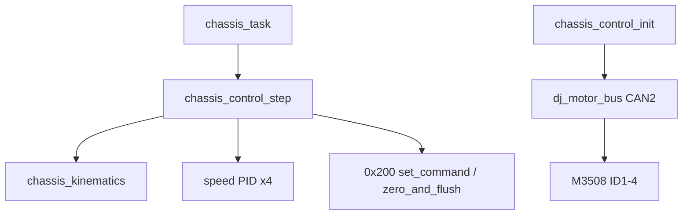

# 变更提案: chassis-control-facade

## 元信息
```yaml
类型: 新功能
方案类型: implementation
优先级: P1
状态: 已确认
创建: 2026-07-20
```

---

## 1. 需求

### 背景
参考工程 `E:\stm32cubemxexe\jie_max\calucate\chassis_control` 已有麦克纳姆混控与 4 路 M3508 速度环实现，但直接耦合遥控器全局变量与 HAL CAN。本仓库 `calculate/chassis_control` 源文件缺失，而 `chassis_task`、`calculate/CMakeLists.txt` 与 `gimbal_control` Facade 已按现代接口约定接入。

### 目标
- 在 `calculate/chassis_control` 实现与 `gimbal_control` 同风格的底盘控制 Facade。
- 将参考工程的麦克纳姆逆运动学与单速度环逻辑迁入，解耦遥控器。
- 默认 `CHASSIS_ACTUATION_ENABLED=0`，故障/离线/未使能路径仅发送 `0x200` 零帧。
- 补齐缺失的 `control_common.h`，保证与现有云台/关节头文件一致。

### 约束条件
```yaml
性能约束: 底盘任务 2ms 周期；无动态分配
兼容性约束: STM32F405、C11、FreeRTOS、dj_motor 写齐再发 API、现有 chassis_task 输入结构
业务约束: CHASSIS_ACTUATION_ENABLED 默认 0；不修改 control_platform（本轮不实现平台）
安全约束: 反馈超时 20ms；安全停机走 dj_motor_zero_and_flush(GROUP_200)
```

### 验收标准
- [ ] 存在 `control_common.h`、`chassis_control.h/.c`、`chassis_kinematics.h/.c`
- [ ] API 覆盖 `init/step/force_stop/get_status`，与 `chassis_task` 调用兼容
- [ ] 默认宏关闭主动输出时只发零命令
- [ ] Debug 构建能编译 chassis 相关源（平台缺失导致链接失败时记录为已知范围外）

---

## 2. 方案

### 技术方案
采用与 `gimbal_control` 相同的固定 Facade：
1. `control_common.h` 提供共享 `control_state_e`。
2. `chassis_kinematics` 纯函数完成麦克纳姆混控与目标转速缩放。
3. `chassis_control` 持有静态 bus/motors/PID/status；`init` 在 CAN2 上注册 4 台 M3508；`step` 做输入校验、反馈在线检查、混控、PID、写齐发送或零帧。

参考 PID 初值：M1=12、M2=8、M3=8、M4=14(+Ki2)，MaxOut=12000，但默认 ACTUATION=0 时不会进入闭环输出路径。

### 影响范围
```yaml
涉及模块:
  - calculate/control_common: 新增共享状态枚举
  - calculate/chassis_control: 新增运动学与 Facade
  - calculate/CMakeLists.txt: 确认 include 含 control_common（如需微调）
预计变更文件: 5-6
```

### 风险评估
| 风险 | 等级 | 应对 |
|------|------|------|
| 轮向符号未实机标定 | 高 | ACTUATION 默认关闭 |
| control_platform 源缺失导致全量链接失败 | 中 | 本轮仅保证底盘源码与接口正确；平台另包 |
| 旧方案包遗留 | 低 | 扫描并保留，不自动归档旧包 |

---

## 3. 技术设计

### 架构设计


### API 设计
- `err_t chassis_control_init(STM32CAN_t *can)`
- `err_t chassis_control_step(const chassis_control_input_t *input, uint32_t now_tick)`
- `err_t chassis_control_force_stop(void)`
- `err_t chassis_control_get_status(chassis_control_status_t *status)`
- `void chassis_kinematics_mecanum(float forward, float lateral, float yaw, float wheel_rpm[4])`

### 状态模型
| 状态 | 说明 |
|------|------|
| UNINITIALIZED | 未 init |
| SAFE_DISABLED | 仅零输出 |
| READY | 健康但 ACTUATION 关闭 |
| ACTIVE | 闭环输出（宏开启时） |
| FAULT | 故障零输出 |

---

## 4. 核心场景

### 场景: 控制周期安全路径
**模块**: chassis_control  
**条件**: 输入离线/未使能/反馈超时/ACTUATION=0  
**行为**: 复位 PID、维持 `dj_motor_zero_and_flush(GROUP_200)` 心跳  
**结果**: 0x200 全零

### 场景: 主动输出（宏开启）
**条件**: enable 且四轮在线  
**行为**: 混控→PID→四路 set_command 写齐发送  
**结果**: ACTIVE

---

## 5. 技术决策

### chassis-control-facade#D001: 对齐 gimbal Facade 而非照搬参考全局模式
**日期**: 2026-07-20  
**状态**: ✅采纳  
**理由**: 用户选择选项 1；`chassis_task` 已依赖该 API。

---

## 6. 成果设计

N/A（非视觉任务）
