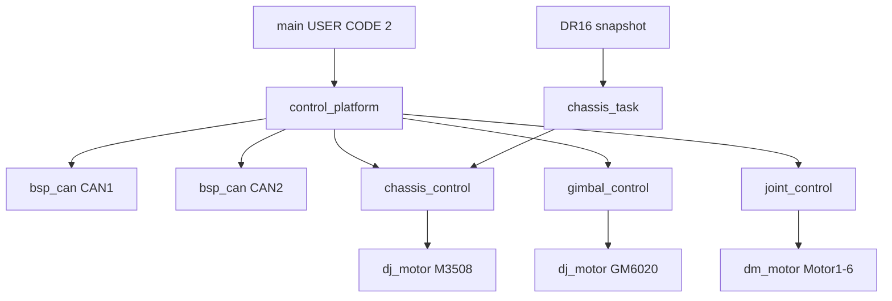

# 变更提案: control-facade-refactor

## 元信息
```yaml
类型: 重构/新功能
方案类型: implementation
优先级: P1
状态: 已确认
创建: 2026-07-20
```

---

## 1. 需求

### 背景
当前 `calculate/chassis_control`、`gimbal_control`、`joint_control` 为空，已有任务和 Motor 模块尚未形成可构建、可安全联调的控制链。旧参考实现直接依赖遥控器全局变量、HAL CAN 句柄和跨子系统状态，且底盘旋转符号存在注释与代码不一致。

### 目标
- 建立固定拓扑的集中 CAN 协调器与三个控制 Facade。
- CAN2 管理 M3508 ID1-4/0x200；CAN1 管理 GM6020 ID1-2/0x1FF 与六台 DM。
- 底盘和云台具备闭环骨架、安全状态与零输出；主动输出默认关闭。
- DM 本轮仅初始化和接收订阅，不产生控制帧。
- 补齐 DR16 原子快照并恢复 Debug/Release 构建。

### 约束条件
```yaml
性能约束: 底盘任务周期2ms；控制代码无动态分配
兼容性约束: STM32F405、C11、FreeRTOS、现有 bsp_can 与 motor API
业务约束: CHASSIS_ACTUATION_ENABLED=0；GIMBAL_ACTUATION_ENABLED=0
安全约束: 所有订阅先于 CAN Start；故障路径显式发送零帧；DM 不使能
```

### 验收标准
- [ ] Debug 与 Release 全量构建通过。
- [ ] 主机单测覆盖底盘混控、缩放、安全状态和平台初始化顺序。
- [ ] CAN1 仅使用一个 `STM32CAN_t`，启动前注册 DJI 与 DM 两个订阅。
- [ ] 0x200 与 0x1FF 上电及失能路径只发送零命令。
- [ ] DR16 非法帧/超时清零，快照读取不撕裂。
- [ ] DM 初始化和订阅不产生 enable、控制或参数轮询帧。

---

## 2. 方案

### 技术方案
采用“固定拓扑 Facade + 集中 CAN 协调器 + 分阶段解锁”。`control_platform` 静态持有两路 BSP CAN 对象，调用三个控制模块完成电机注册和 DM 订阅，最后统一启动 CAN。控制任务只提供通用输入；各控制 Facade 管理反馈、PID、安全状态和 Motor API。

### 影响范围
```yaml
涉及模块:
  - calculate: 新增平台、底盘、云台、关节控制实现及主机测试
  - modules/DR16: 新增安全快照并修复非法帧清零
  - Core/task: 启动前平台初始化与底盘任务迁移
  - build/knowledge: CMake 接入、知识库与变更记录
预计变更文件: 15-25
```

### 风险评估
| 风险 | 等级 | 应对 |
|------|------|------|
| 电机安装方向和底盘旋转符号未实机确认 | 高 | 主动输出宏默认关闭，方向配置标记未验证 |
| CAN1 被重复初始化或启动后订阅 | 高 | 唯一平台对象集中编排并增加顺序单测 |
| DR16 子模块改动影响根仓库状态 | 中 | 不自动提交，记录子模块优先提交顺序 |
| CAN 邮箱 BUSY 导致零帧发送失败 | 中 | Facade 记录重试状态，下周期继续零输出 |

---

## 3. 技术设计

### 架构设计


### API 设计
- `control_platform_init/get_state/force_stop`
- `chassis_control_init/step/force_stop/get_status`
- `gimbal_control_init/step/force_stop/get_status`
- `joint_control_init/get_status`
- `DR16_GetSnapshot`

### 状态模型
| 状态 | 说明 |
|------|------|
| UNINITIALIZED | 尚未完成依赖绑定 |
| SAFE_DISABLED | 初始化完成但只允许零输出 |
| READY | 输入与反馈健康，等待显式使能 |
| ACTIVE | 仅在编译开关与运行请求同时允许时进入 |
| FAULT | 初始化、反馈或发送故障，保持零输出 |

---

## 4. 核心场景

### 场景: 安全启动
**模块**: control_platform
**条件**: HAL 外设初始化完成、调度器未启动
**行为**: 初始化 DWT、配置过滤器、注册 DJI/DM、启动 CAN、发送两组零帧
**结果**: 平台处于 SAFE_DISABLED，无非零电机输出

### 场景: 底盘控制周期
**模块**: chassis_control
**条件**: DR16 快照在线且右拨杆 MID，四轮反馈均在线
**行为**: 通用输入映射、麦克纳姆混控、比例缩放、四路速度 PID、写齐 0x200
**结果**: 默认 actuation 关闭时仍只发送零命令；开启后才允许闭环输出

### 场景: 被动关节监听
**模块**: joint_control
**条件**: CAN1 已完成 DM 订阅
**行为**: 只更新 Motor1-6 反馈状态
**结果**: 不发送 enable、位置、MIT 或寄存器读取命令

---

## 5. 技术决策

### control-facade-refactor#D001: 选择固定 Facade 与集中 CAN 协调器
**日期**: 2026-07-20
**状态**: ✅采纳
**背景**: CAN1 需要同时服务 GM6020 与 DM，多个任务分别初始化会违反 BSP 生命周期约束。
**选项分析**:
| 选项 | 优点 | 缺点 |
|------|------|------|
| 固定 Facade + 集中协调器 | 接口少、启动顺序明确、便于嵌入式调试 | 与当前 Motor API 绑定较深 |
| 通用依赖注入端口 | 主机可测试性强、后端可替换 | 文件和样板代码过多 |
**决策**: 选择固定 Facade + 集中协调器
**理由**: 固定硬件拓扑下兼顾安全、可维护性和实施成本，避免过度抽象。
**影响**: calculate、任务启动、DR16 与构建系统

---

## 6. 成果设计

N/A（非视觉任务）
